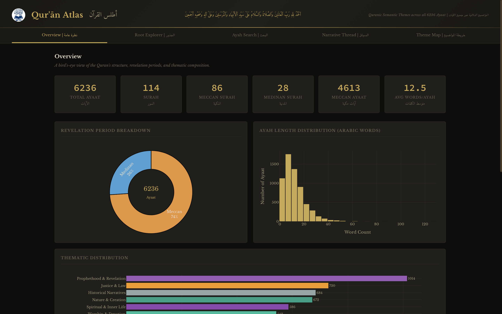
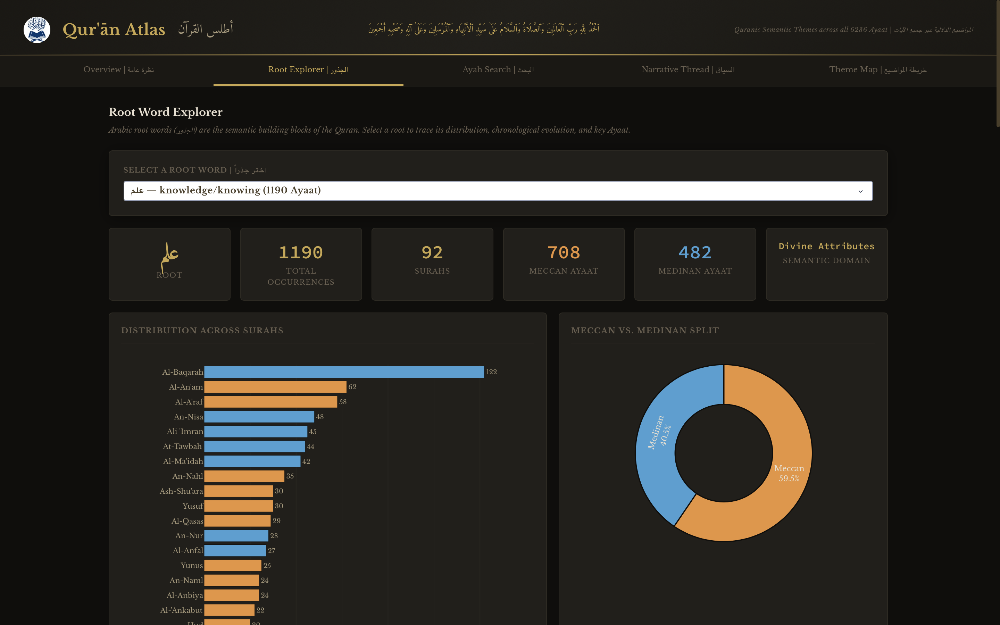
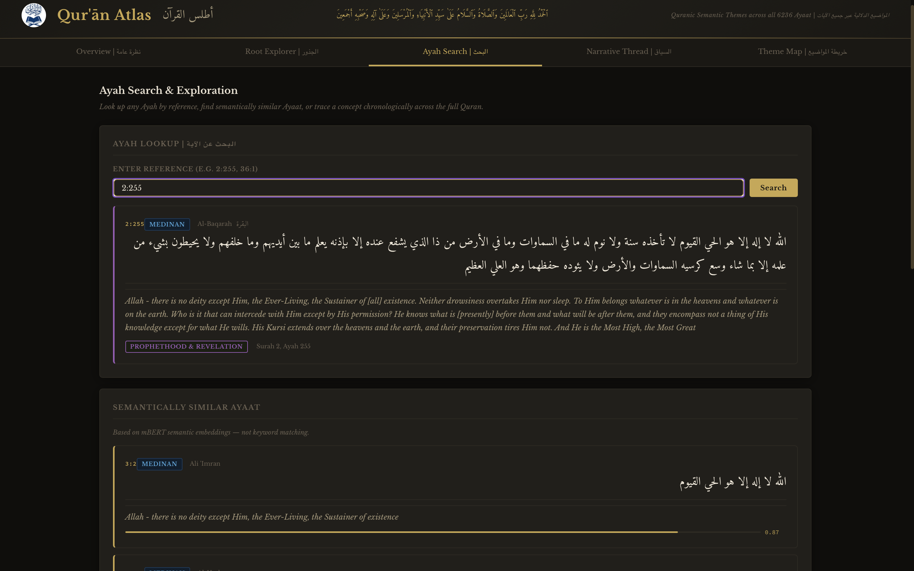
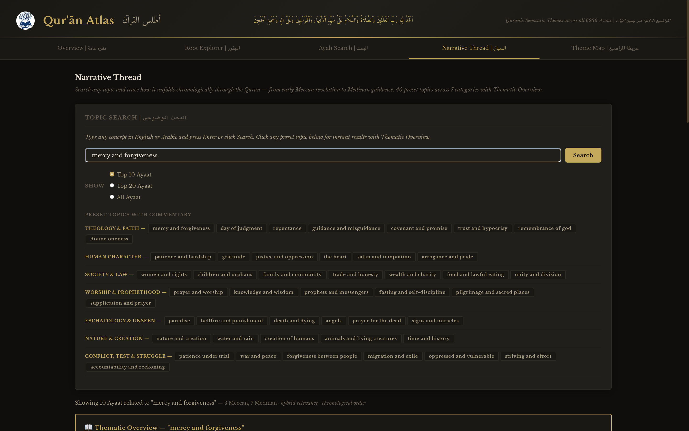
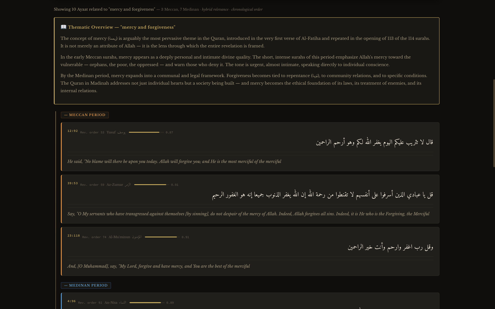
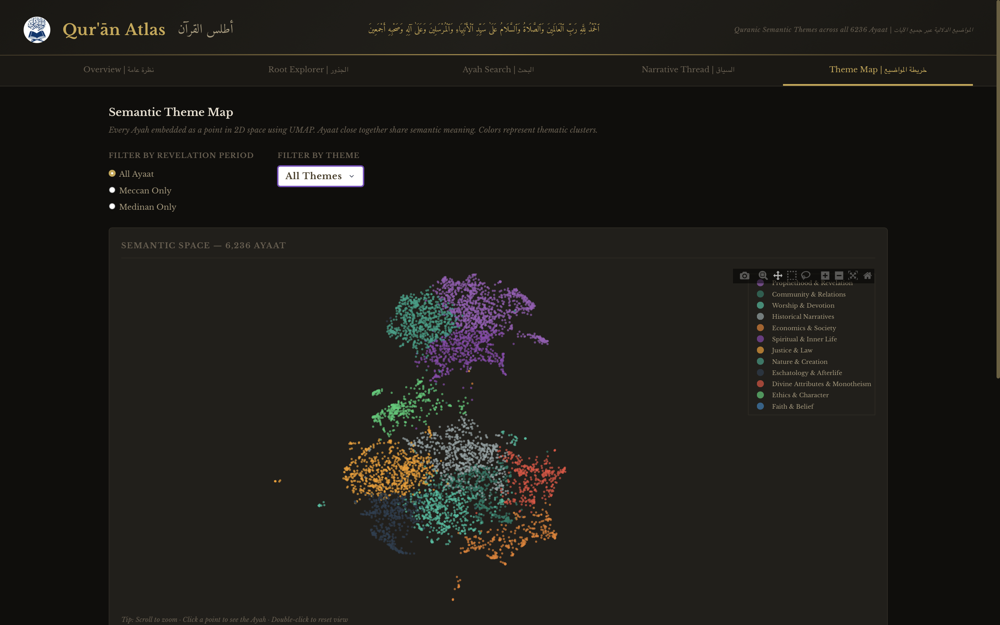

# Quran Atlas | أطلس القرآن

**Quranic Semantic and Thematic Analytics**

A full-stack interactive analytics dashboard exploring all 6,236 Ayaat of the Noble Quran through NLP, semantic search, and scholarly commentary. Built to bridge traditional Islamic scholarship with modern computational linguistics.

Live demo (Hugging Face Spaces): coming soon
Live demo (Render): coming soon

Most Quran search tools work the same way: type a word, get a list of Ayaat containing that word. No sense of how a concept develops over time, no way to see which themes dominate early Meccan revelation versus later Medinan legislation, no way to find Ayaat that are semantically close even when they share zero keywords. This project is an attempt to fix that.

---

## Preview

**Overview**


**Root Word Explorer**


**Ayah Search**


**Narrative Thread**



**Semantic Theme Map**



---

## Features

### Overview

A statistical bird's-eye view of the Quran's structure: revelation period breakdown, Ayah length distribution by Arabic word count, thematic distribution across 12 semantic clusters, and chronological Ayah count by revelation order across all 114 Surahs.

### Root Word Explorer

Arabic is a root-based language. Every word derives from a 3-letter root that carries its core meaning. Select any of 160 Arabic roots sourced from the Leeds Quranic Corpus and instantly see:

- Total occurrences across all 6,236 Ayaat
- Distribution across Surahs (horizontal bar chart, sorted by count)
- Meccan vs. Medinan split (donut chart)
- Chronological timeline by revelation order
- Sample Ayaat with Arabic text and Sahih International translation
- Click any bar to filter Ayaat by that specific Surah

Root detection uses word-boundary aware surface form matching against curated lists of actual Quranic word forms extracted directly from the Tanzil XML, replacing naive substring matching which produced false positives in Arabic morphology.

### Ayah Search and Exploration

Look up any Ayah by reference (e.g. 2:255, 36:1) and get the full Arabic text, translation, and thematic classification. Below the lookup, a ranked list of semantically similar Ayaat is shown using cosine similarity over sentence embeddings, finding Ayaat that mean similar things even when they share no keywords.

### Narrative Thread

The flagship feature. Search any Islamic concept and trace how it unfolds chronologically through the Quran from early Meccan revelation to Medinan guidance.

**40 preset topics across 7 categories**, each with full scholarly commentary:

- Theology and Faith: mercy and forgiveness, day of judgment, repentance, guidance and misguidance, covenant and promise, trust and hypocrisy, remembrance of Allah, divine oneness
- Human Character: patience and hardship, gratitude, justice and oppression, the heart, satan and temptation, arrogance and pride
- Society and Law: women and rights, children and orphans, family and community, trade and honesty, wealth and charity, food and lawful eating, unity and division
- Worship and Prophethood: prayer and worship, knowledge and wisdom, prophets and messengers, fasting and self-discipline, pilgrimage and sacred places, supplication and prayer
- Eschatology and Unseen: paradise, hellfire and punishment, death and dying, angels, prayer for the dead, signs and miracles
- Nature and Creation: nature and creation, water and rain, creation of humans, animals and living creatures, time and history
- Conflict, Test and Struggle: patience under trial, war and peace, forgiveness between people, migration and exile, oppressed and vulnerable, striving and effort, accountability and reckoning

Each preset topic includes a 3-paragraph thematic overview placing the topic in its Meccan and Medinan revelatory context, written in the style of traditional Quranic scholarship.

Custom search accepts any English concept and uses auto-expansion against a curated Islamic vocabulary map to improve semantic matching.

Results are ranked using a hybrid score combining semantic similarity and keyword presence, displayed in chronological revelation order with Meccan and Medinan period dividers.

### Semantic Theme Map

All 6,236 Ayaat embedded into 2D space using UMAP dimensionality reduction, clustered into 12 semantic themes using KMeans. The spatial layout reflects semantic proximity: Ayaat that mean similar things appear near each other regardless of which Surah they belong to. Scroll to zoom, click any point to read the Ayah.

**Research note:** Cluster labels are approximate. KMeans partitions embedding space into hard boundaries that do not always align with the fluid, overlapping thematic structure of Quranic discourse. Structurally repetitive passages such as the refrain of Surah Ar-Rahman form isolated clusters based on linguistic form rather than theological content. Future work will explore BERTopic and fine-tuned Quranic embeddings. Planned improvements: BERTopic, fine-tuned Quranic embeddings, manual cluster validation by Islamic scholars.

---

## Tech Stack

| Layer | Technology |
|---|---|
| Dashboard | Dash 2.0.0, Plotly 4.12.0, Flask 1.1.2, gunicorn 20.1.0 |
| Embeddings | sentence-transformers 2.2.0, paraphrase-multilingual-mpnet-base-v2 |
| Dimensionality Reduction | UMAP 0.4.6 |
| Clustering | scikit-learn 0.23.2 (KMeans) |
| Database | SQLite 3, pandas 1.1.3, numpy 1.19.2 |
| Quran Text | Tanzil.net Simple Clean XML |
| Translation | Sahih International via quran-json |
| Typography | Amiri (Arabic), Libre Baskerville (English) |
| Language | Python 3.8 |

---

## Project Structure

```
quran-atlas/
├── dashboard/
│   ├── assets/
│   │   ├── LQ_logo.png
│   │   └── style.css
│   ├── callbacks/
│   │   ├── narrative_callbacks.py
│   │   ├── root_callbacks.py
│   │   ├── search_callbacks.py
│   │   └── theme_callbacks.py
│   ├── layouts/
│   │   ├── narrative.py
│   │   ├── overview.py
│   │   ├── roots.py
│   │   ├── search.py
│   │   └── themes.py
│   ├── app.py             Main app entry point
│   └── server.py          Dash server instance
├── data/
│   ├── quran_data.py              Surah metadata, root word forms, XML parser
│   ├── quran_data_backup.py       Pre-refactor backup, kept for reference
│   ├── quran-simple.xml           Tanzil Simple Clean XML (download separately)
│   ├── root_forms_report.txt      Output of extract_root_forms.py
│   └── verified_root_forms.json   Verified surface forms per root
├── db/
│   ├── schema.sql          Full relational schema with views and indexes
│   ├── seed.py             Database population script
│   └── quran.db            SQLite database (generated)
├── embeddings/
│   ├── generate_embeddings.py             Sentence embedding generation
│   ├── cluster_themes.py                  UMAP and KMeans theme clustering
│   ├── similarity_search.py               Cosine similarity lookup
│   ├── verse_embeddings.npy                Generated embeddings (generated)
│   ├── verse_embeddings_verse_ids.txt      Verse ID index for embeddings
│   ├── verse_embeddings_verse_ids_backup.txt   Backup from pre-mpnet run
│   ├── umap_2d.npy                         2D coordinates for scatter plot
│   ├── umap_2d_with_ids.npz                Bundled coords and verse IDs
│   ├── cluster_labels.npy                  KMeans cluster assignment per verse
│   └── cluster_labels_readable.csv         Human-readable cluster export
├── scripts/
│   ├── extract_root_forms.py      Extract Arabic surface forms from XML
│   ├── add_missing_roots.py       Add roots found in extraction but absent from COMMON_ROOTS
│   ├── fix_duplicates.py          Remove duplicate root keys
│   ├── fix_verse_roots.py         Repair denormalized columns in verse_roots
│   ├── patch_quran_data.py        Patch verified forms into quran_data.py
│   ├── check_setup.py             Environment verification
│   └── export_report.py           CSV export with UTF-8 BOM encoding
├── docs/
│   ├── screenshots/
│   ├── ARCHITECTURE.md
│   └── REPORT.md
├── tests/
│   ├── test_pipeline.py
│   └── test_similarity.py
├── .env.example
├── .gitignore
├── CHANGELOG.md
├── LICENSE
├── Makefile
├── requirements.txt
├── Dockerfile
├── render.yaml
├── Procfile
├── huggingface_app.py     Entry point for Hugging Face Spaces deployment
└── deployment_guide.md
```

Note: __pycache__ and __init__.py files exist throughout the Python package structure as standard and are omitted above for clarity.

---

## Setup and Installation

### Prerequisites

- Python 3.8 or higher
- Approximately 2GB disk space for embeddings and model weights
- Tanzil Simple Clean XML file (download instructions below)

### Step 1: Clone and Install

```bash
git clone https://github.com/LearnQuranAcademy/quran-atlas.git
cd quran-atlas

python3 -m venv venv
source venv/bin/activate

pip install -r requirements.txt
```

### Step 2: Download Quran Text

Go to tanzil.net/download, choose Simple (Unvoweled) format, and save the file as:

```
data/quran-simple.xml
```

The Sahih International translation is fetched automatically on first run.

### Step 3: Configure Environment

```bash
cp .env.example .env
```

### Step 4: Verify Setup

```bash
python3 scripts/check_setup.py
```

### Step 5: Build the Database

```bash
python3 db/seed.py
```

### Step 6: Generate Embeddings

Downloads approximately 1.1GB model on first run, cached after that.

```bash
python3 embeddings/generate_embeddings.py --mode english
```

Estimated time: 20 to 40 minutes on CPU, 3 to 5 minutes on GPU.

### Step 7: Generate Theme Clusters

```bash
python3 embeddings/cluster_themes.py
```

Estimated time: 30 to 60 minutes on CPU.

### Step 8: Run the Dashboard

```bash
python3 -m dashboard.app
```

Open http://127.0.0.1:8050 in your browser.

To run everything at once:

```bash
make pipeline
```

---

## Database Schema

Six tables with three pre-joined views:

```
surahs         Surah metadata: name, revelation type, revelation order
verses         All 6,236 Ayaat: Arabic text and English translation
root_words     160 Arabic roots with semantic domains and occurrence counts
verse_roots    Many-to-many: which roots appear in which Ayah
themes         12 semantic theme clusters from KMeans
verse_themes   Many-to-many: Ayah to theme assignment with confidence score

v_verses_full          Pre-joined verse and Surah data
v_root_distribution    Root occurrences aggregated by Surah
v_theme_by_revelation  Theme counts grouped by revelation period
```

---

## Data Sources

| Source | Usage | License |
|---|---|---|
| Tanzil.net | Quran Arabic text, Simple Clean format | Creative Commons |
| Sahih International | English translation | Public domain |
| Leeds Quranic Corpus, University of Leeds | Root word frequencies and lemma lists | GNU Public License |
| Al-Mufradat fi Gharib al-Quran, Al-Raghib Al-Asfahani | Semantic domain classification | Public domain |

---

## Methodology Notes

**Semantic search** uses paraphrase-multilingual-mpnet-base-v2, a model trained on 50 million sentence pairs specifically for semantic similarity tasks. Results use hybrid scoring: 85 percent semantic similarity plus 15 percent keyword presence boost. An adaptive threshold based on mean plus standard deviation of the score distribution filters results per query rather than using a fixed cutoff.

**Root word matching** uses word-boundary aware surface form matching. Each root has a curated list of actual word forms extracted from the Tanzil XML using ordered-subsequence letter matching, not substring search. This eliminates false positives from Arabic morphological ambiguity.

**Theme clustering** reduces 768-dimensional embeddings to 20 dimensions using UMAP before KMeans clustering. This avoids the curse of dimensionality that affects KMeans at high dimensions while retaining semantic structure. A separate 2D UMAP reduction is used for the scatter plot visualization.

---

## Running Tests

```bash
make test
# or: python3 -m pytest tests/ -v
```

---

## Exporting Data

```bash
make export
```

Outputs CSV files to the exports directory with UTF-8 BOM encoding for correct Arabic rendering in Excel.

---

## Roadmap

- BERTopic for more semantically faithful theme clustering
- Fine-tuned Quranic sentence embeddings
- Arabic custom search support
- Full Arabic morphological analysis replacing surface form matching
- Surah-level narrative analysis
- Scholar-validated cluster labels
- Tafsir integration for verse commentary
- Mobile-responsive layout (currently optimised for desktop)
- Public deployment

---

## About

A LearnQuran Academy project, building tools that bridge the Noble Quran and modern technology to make Quranic study more accessible, structured, and analytically rich.

YouTube: https://www.youtube.com/@LearnQuran_iqra
Contact: learnquran.iqra@gmail.com

Quran text from Tanzil.net. Translation: Sahih International.

---

## License

This project is licensed under the MIT License. See LICENSE for details.

The MIT License covers the source code only. Quran text is from Tanzil.net (Creative Commons, unmodified redistribution required). Translation is Sahih International (free for non-commercial use). Root word frequency data is derived from the Quranic Arabic Corpus, University of Leeds (GNU General Public License). See LICENSE for full attribution terms.

---

2019-2022 LearnQuran Academy. All Rights Reserved.

---

**kayShahbaaz خ شهباز**